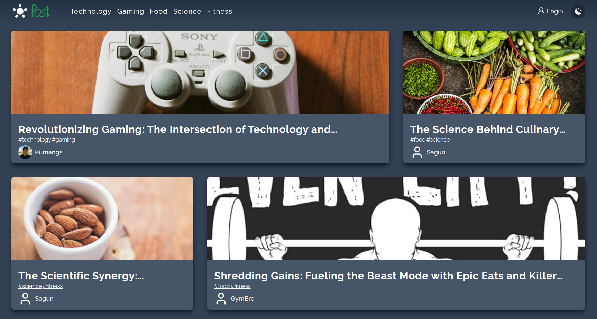
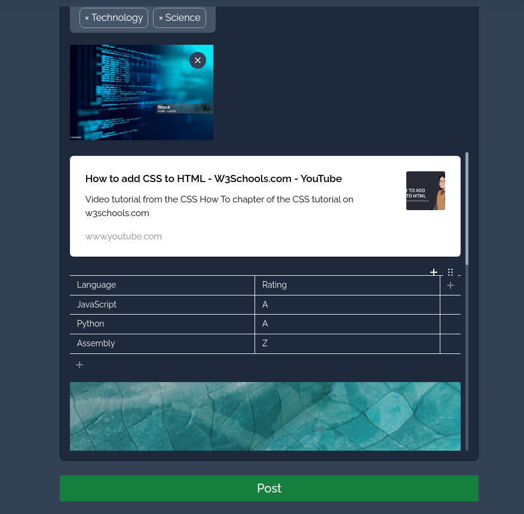

# Post Web App



## Overview

Post is a visually stunning blog website that provides users with a platform to share their thoughts and ideas. Built with React and Vite, the app stands out with its captivating animations powered by Framer Motion. Post integrates seamlessly with AWS services, utilizing S3 for image uploads and RDS with MySQL in the backend. Editor.js is used to enhance the writing experience, allowing users to create stylish and engaging posts.

## Features



- Visually Stunning Animations using Framer Motion
- AWS Integration: Image upload using presigned url from backend.
- Database Management: Backend uses AWS Rds mysql
- Editor.js for Stylish Posts: A user-friendly interface for creating visually appealing content.

## Tech Stack

Frontend

[](https://skillicons.dev) framer-motion and react-router-dom

Backend (<a href="https://github.com/kumang-subba/post-webapp-api">Link here</a>)

[](https://skillicons.dev)

## Getting started

1. Clone the repository: `git clone https://github.com/kumang-subba/post-webapp.git`
2. Navigate to the project directory
3. Install dependencies: `npm install`
4. Start the development server: `npm run dev`

.env sample

```js
VITE_API_URL=
```
